# Architecture

This document describes how obsidian-mind fits together — the load-bearing seams, the design choices behind them, and where to extend the system. It is aimed at contributors and anyone forking the template who wants to customize it without breaking the mechanics.

It is not a folder tour. For the day-to-day layout, read `CLAUDE.md`. For the user-facing story, read `README.md`.

---

## System Overview

obsidian-mind is a plain Obsidian vault with four systems layered on top:

1. **The vault itself** — Markdown files, frontmatter, wikilinks. Portable, git-tracked, Obsidian-browsable.
2. **A hook pipeline** — small TypeScript scripts invoked by the agent harness at lifecycle events (session start, every message, after writes, before compaction, at session end).
3. **A semantic search layer (QMD)** — a separate CLI + SQLite index + MCP server, all scoped to a named index read from `vault-manifest.json`.
4. **The `om` MCP server** — the vault as a service, so a session running in a *different repository* can search it, read notes, follow the graph, and record back into it.

The layers communicate through one coordination point: **`vault-manifest.json`**. It declares the template version, the QMD index name, which folders the server serves, where memories live, and the boundary between infrastructure files (shipped by the template) and user content (created by the human).

The fourth layer is the one that changes the shape of the system. Layers 1–3 assume the agent is *sitting in the vault*; `om` removes that assumption, which is why identity — "which repo is asking?" — becomes a first-class concept below.

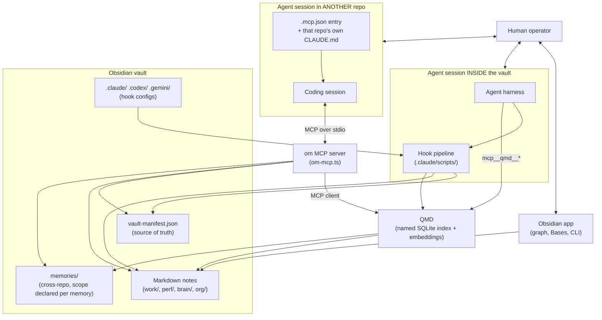

The vault is the persistent state. Everything else is machinery around it.

---

## Division of Responsibility

Two actors do the work, and the boundary between them is the most important design choice in the system.

**Procedural code owns the environment.** Hooks in `.claude/scripts/` classify messages, validate writes, maintain the QMD index, inject context at session start, and back up transcripts before compaction. None of this logic is in the agent's head. It runs identically whether the agent is Claude Code, Codex, or Gemini, and it produces deterministic, testable behavior — every contract in `.claude/scripts/lib/` is locked by a unit suite, run in CI on every push.

**The agent owns content.** Writing notes, choosing where to file them, adding wikilinks, updating indexes, promoting thinking drafts, drafting review briefs — these are judgments, not rules, and they live with the agent. `CLAUDE.md` documents the conventions the agent should follow; it does not replace the agent's judgment.

The two halves meet at small, well-defined handoffs: hooks inject context and routing hints through stdout, the agent reads the vault and calls Write or Edit. Neither side reaches across the boundary. This is what keeps the hooks portable (no agent-specific logic) and keeps the agent's tokens pointed at judgment rather than bookkeeping.

---

## Design Principles

Four ideas shape every decision in this template. When a change breaks one of them, it needs a very good reason.

### 1. Graph-first, not folder-first

Folders group by purpose. Links group by meaning. A note lives in one folder (its home) but links to many notes (its context). Competency notes stay definitional and receive evidence through backlinks — review prep becomes reading the backlinks panel on each competency. This is why every new note must link to at least one existing note, and why the agent is instructed to treat orphan notes as bugs.

### 2. Vault-first memory

All durable knowledge lives in the vault, inside `brain/` topic notes. The agent-specific memory indexes (`~/.claude/.../MEMORY.md`) are pointers to vault locations, never the storage themselves. This keeps memory git-tracked, machine-portable, and visible in the Obsidian graph.

The `om` server extends this outward rather than around it. A session in another repo writes into `memories/` — still Markdown, still in the graph, still yours to open in Obsidian — instead of into a private store belonging to some memory service. A generic memory server solves the wrong half of the problem: it gives you a *second* knowledge base that is not your vault.

Because those memories are written from many repos and read by many repos, each one **declares its reach when written** — which projects and platforms it applies to. A reader never widens what a writer declared. That is a relevance rule, not an access-control rule: the store is the user's, the sessions are the user's, and the question being answered is "which lessons bear on the repo asking?" — not "who is allowed to know this?"

### 3. Progressive disclosure

`SessionStart` injects a small block of lightweight context (North Star excerpt, git summary, tasks, file listing). Full note contents are pulled on demand via QMD semantic search. A full file read is a last resort, not a default.

Session cost stays flat regardless of vault size because it is **enforced**, not merely intended. Two of those inputs grow with the vault — the file listing grows with every note, the North Star excerpt with every status edit — so without a ceiling the eager layer drifts upward a little every day and nobody notices until a session is paying for it. A byte budget holds the total; over it, the cheapest-to-lose sections degrade to pointers, worst-priority first, and the closing size meter names each one it dropped. Line-based caps cannot do this job: shortening entries under a line cap just slides the window deeper and refills it. Budget and listing-collapse threshold are set in `vault-manifest.json`.

**The budget is a runaway guard, not a squeeze — set it above everything worth injecting.** The meter is the detector; the budget is only the emergency brake. A ceiling low enough to bite in normal use degrades your context every session instead of catching a problem, and the two failures are not symmetric: a ceiling set too high still leaves the drift visible in the meter every session, while one set too low silently removes context you never learn you were missing. If the budget starts firing, the right response is usually to raise it and look at what grew — not to accept running degraded.

The same asymmetry decides *what* may degrade. Rank the eager layer by **value density, not size**: filenames are the cheapest bytes (one Glob rebuilds them), so the listing surrenders first. Anything irreplaceable — identity, personal context, correctness guards — carries no fallback and is never traded for plumbing. Optimizing this layer means removing **duplication**, not **information**, which is exactly why re-entry via resume/compact drops the static bulk: it is already in the conversation, so omitting it loses nothing.

### 4. Agent-agnostic core

The hook scripts, subagent prompts, command definitions, and vault conventions are pure Markdown and TypeScript with no SDK dependencies. Each agent (Claude Code, Codex CLI, Gemini CLI) brings its own config file pointing at the same scripts. Only the `~/.claude/` auto-memory loader is Claude Code-specific.

---

## The Manifest as Source of Truth

`vault-manifest.json` is the one file that every layer reads. It answers eight questions:

| Question | Field |
|----------|-------|
| What version of the template is this? | `version`, `released`, `version_fingerprints` |
| What does QMD call its store? | `qmd_index`, `qmd_context`, `qmd_min_version` |
| Which files are template infrastructure? | `infrastructure[]` |
| Which files are user content? | `user_content_roots[]`, `scaffold{}` |
| What frontmatter is required for each note type? | `frontmatter_required{}` |
| Which notes does the `om` server serve, and where do memories live? | `mcp_exposed_roots[]`, `mcp_never_expose[]`, `memory_root`, `mcp_inbox` |
| How much context may the eager layer spend? | `eager_layer_budget_bytes`, `listing_collapse_threshold` |
| Which model does a `reason` spawn run on? | `reason.model` — unset means the user's own CLI default |

The `qmd_index` field is the most load-bearing. **Five independent callers** read it, and they fail *silently* when they disagree — one writes to a store another never reads, which surfaces only as "0 documents" or as an empty search:

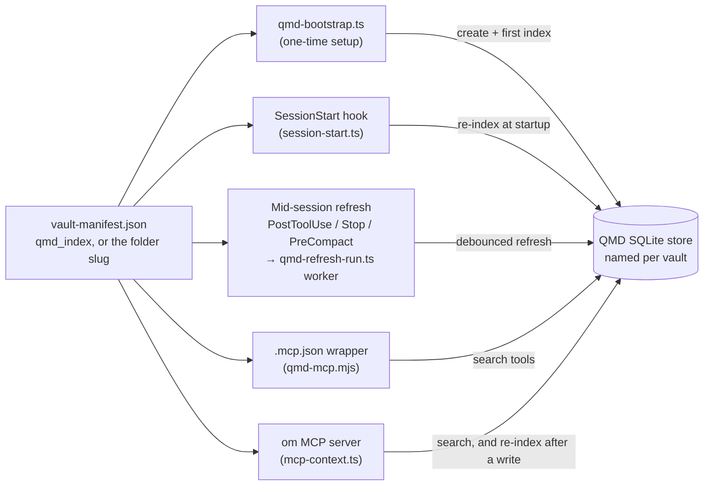

All five resolve the name through one function, `resolveQmdIndex` — the `qmd_index` field when pinned, otherwise the vault folder name slugified — so the vault coexists with other QMD-indexed projects on the same machine without collision. The template ships the field empty so two installs never share a store by default. Set `qmd_index` and the next bootstrap creates a fresh, isolated store under that name.

Routing every caller through one resolver is the fix for a real class of failure rather than a tidiness preference: a hardcoded or independently-derived name in any one of the five produces a vault that indexes into one store and searches another, with nothing anywhere reporting an error. `health` on the `om` server checks that the index it would query actually belongs to this vault.

The `infrastructure[]` vs `user_content_roots[]` split is what makes `/om-vault-upgrade` work. When importing from an older template, the migrator overwrites infrastructure files wholesale and preserves user content untouched.

---

## Lifecycle Hooks

Five hooks run at different moments in a session. Each is a small Node script invoked via `--experimental-strip-types` (TypeScript executes directly, no build step).

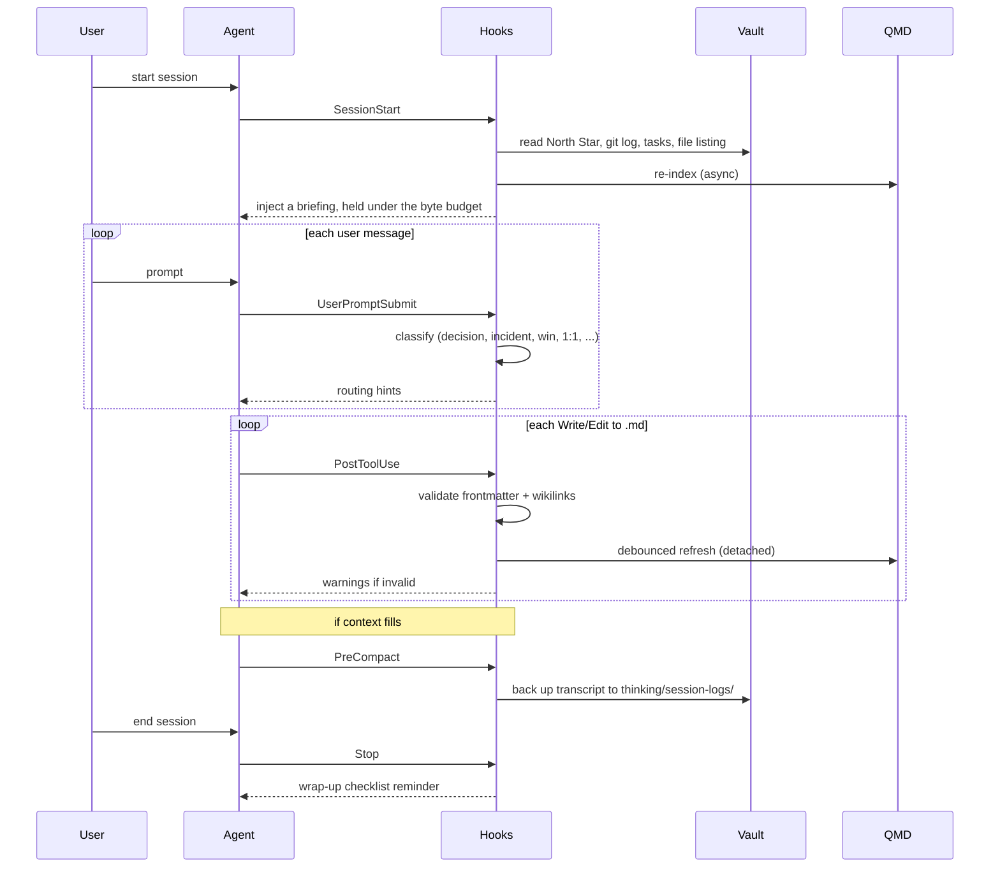

A few specific design choices are worth calling out:

- **`SessionStart` injects, it does not load.** It builds a briefing (filename listing, North Star excerpt, git summary, open tasks aggregated from `work/active/` and the vault root) and hands it to the agent. Full note contents never flow through this hook. Its size is bounded by `eager_layer_budget_bytes` and reported by the meter on the last line of every injection, so the cost is visible rather than assumed. The open-tasks scan is filesystem-only so the hook never spawns the Obsidian CLI — that subprocess flashes the Electron app on macOS when no instance is running (#83).
- **`UserPromptSubmit` classifies, it does not route.** It tags the prompt with hints like `ARCHITECTURE discussion` or `DECISION`; the agent decides where to file. Keeping the hook opinion-free means the routing logic lives in `CLAUDE.md`, which is editable per-user without touching scripts.
- **QMD refresh is shared, debounced, and detached.** Three hook entries fire the same refresh helper — `PostToolUse` (after `.md` writes), `PreCompact` (before transcript backup; writes tend to cluster before compaction), and `Stop` (end of session) — sharing one sentinel file so a burst of events produces at most one worker per debounce window. The actual indexing runs in `.claude/scripts/qmd-refresh-run.ts` as a detached, stdio-silent worker (`qmd update` → `qmd embed` → tail-chase `qmd update`), so the parent hook returns in milliseconds and nothing flows to the agent's context.
- **`PreCompact` also backs up the transcript.** In addition to kicking the QMD refresh, it copies the current session transcript out to `thinking/session-logs/` so long conversations remain recoverable after compaction.
- **`Stop` is deliberately lightweight.** Beyond triggering the shared refresh, it only prints a short checklist. For a thorough review, the user invokes `/om-wrap-up` explicitly. Putting heavy logic in a Stop hook would slow every session exit and surprise the user.

---

## QMD Integration

QMD provides semantic search. It is the mechanism behind most of the agent's retrieval intelligence. Four entry points all read from the same named index:

| Caller | Entry point | When |
|--------|-------------|------|
| Agent tool menu | `.mcp.json` → `qmd-mcp.mjs` | Every `mcp__qmd__*` tool call from a session inside the vault |
| Session startup | `session-start.ts` | Re-index on every new session |
| Mid-session refresh | `validate-write.ts` / `stop-checklist.ts` / `pre-compact.ts` → `lib/qmd-refresh.ts` (shared sentinel + debounce) → detached `qmd-refresh-run.ts` | After `.md` writes, at session end, and before compaction |
| The `om` server | `lib/mcp-qmd-client.ts` (search) and `reindexSync` (after a write) | Every `search`, every queried `recall`, every `remember` / `record_work` |

Every `qmd update` invocation re-reads the per-index YAML (`~/.config/qmd/<index>.yml`), so changes to the collection config — including the ignore list synced from `.obsidian/app.json` — propagate to every surface without a session restart.

### What QMD actually runs

Worth understanding, because it explains the cost profile of everything built on top. QMD runs **three small models locally**. There is no API key, no per-query cost, and it works offline.

| model | size | job |
|---|---|---|
| `embeddinggemma-300M` | ~328 MB | turns notes and queries into vectors |
| `qmd-query-expansion-1.7B` | ~1.28 GB | rewrites a query into better search terms, and writes hypothetical answers for HyDE |
| `Qwen3-Reranker-0.6B` | ~640 MB | reorders the shortlist by actual relevance |

They download on first use and are cached. QMD offloads to the GPU when it finds one — CUDA on a discrete card, Metal on Apple Silicon — and falls back to CPU otherwise. `qmd doctor` reports which.

The CLI verbs map onto that stack, cheapest first:

| verb | what runs | cost |
|---|---|---|
| `qmd search` | BM25 keyword matching, **no model at all** | instant |
| `qmd vsearch` | vector search — embeds the query, then compares | one embed |
| `qmd query` | the full hybrid: sub-queries, then rerank | embed + optional expansion + rerank |
| `qmd update` | parse and index note **text** | no model |
| `qmd embed` | build the **vectors** for new or changed notes | the embedding model, per note |

Two consequences shape the design of everything downstream:

- **`update` and `embed` answer different questions.** `update` decides whether a note is *findable at all*; `embed` decides only where it *ranks*. They are separated everywhere in this template, and the split is why a write can report success honestly without waiting on a local model run.
- **Reads are the expensive side, not writes.** A query has to embed before it can search, so a semantic lookup costs a model pass while a keyword lookup costs none. This is the opposite of the usual database intuition, and it is why the retrieval paths below are careful about *when* they pay for a vector.

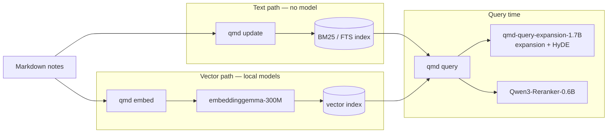

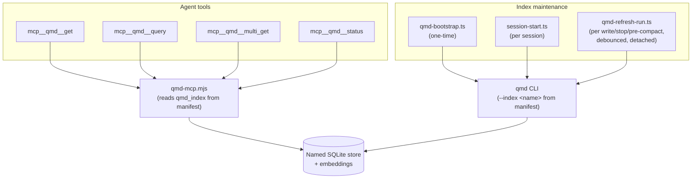

QMD is technically optional. When it isn't installed at all, the agent falls back through a preference order defined in `CLAUDE.md` and the qmd skill: MCP tools first when registered, then the `qmd` CLI, then Grep/Glob/Read as a last resort. Every fallback step is non-fatal: `.mcp.json` entries that fail to launch are skipped with a harmless warning, the hook scripts detect a missing `qmd` binary and no-op, and the operating manual tells the agent what to reach for next.

### QMD over MCP — the in-vault retrieval path

> This section is about the **`qmd`** MCP server, which a session *inside* the vault uses. The **`om`** server, which a session in another repo uses, is a different thing built on top of it — see [Reaching the Vault From Another Repo](#reaching-the-vault-from-another-repo). The one rule connecting them: a consuming repo registers `om`, never raw `qmd`.

When the MCP server is registered, the agent's normal path to QMD is through typed tools — `mcp__qmd__query`, `mcp__qmd__get`, `mcp__qmd__multi_get`, and `mcp__qmd__status` — that appear in its tool menu alongside Read and Edit. These come from the [Model Context Protocol](https://modelcontextprotocol.io) server declared in `.mcp.json`, launched by a thin wrapper (`.claude/scripts/qmd-mcp.mjs`) that reads `qmd_index` from the manifest and invokes `qmd mcp` underneath. The CLI remains available — and is documented as the fallback — but during a session with MCP live, the agent goes through typed tools, not shell.

The wrapper exists so that each vault can run its own isolated index without users hand-editing `.mcp.json`. The index name flows from the manifest into the wrapper, the wrapper into QMD, QMD into its per-vault SQLite store.

The contract matters because the alternative — teaching every subagent and slash command to shell out to `qmd search` on every call — would couple each prompt to QMD's CLI surface, duplicate parse/retry logic across files, and force every prompt to re-explain the tool. MCP collapses all of that into one typed interface for the in-session path. When QMD changes its CLI, the wrapper adapts; the rest of the template is insulated. When another MCP-aware service needs to join the vault (a bug tracker, a docs search, a calendar), it registers in `.mcp.json` and gains the same privileged position.

### One ignore list, two engines

Obsidian and QMD both need to know which files to hide from search. Rather than maintain two lists that can drift, the template treats `.obsidian/app.json` → `userIgnoreFilters` as the single source of truth. `qmd-bootstrap.ts` reads that array and writes it into the QMD per-index YAML (`~/.config/qmd/<index>.yml`) as the collection's `ignore` field. Every subsequent `qmd update` (initial index, mid-session refresh, session-start reindex) honors the list.

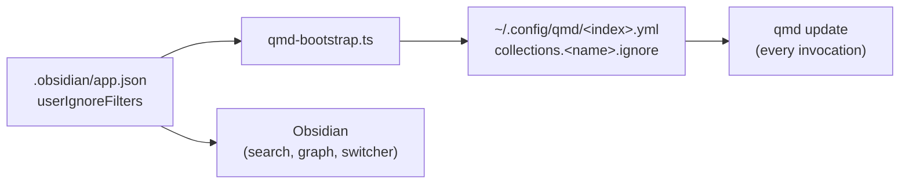

This is why the list lives in Obsidian's config and not `vault-manifest.json`: users who adjust what's hidden in Obsidian's UI get the same change propagated to QMD on the next bootstrap. Files that are infrastructure (template dev docs like this one, `CHANGELOG.md`, `CONTRIBUTING.md`) are good candidates; user-authored content should not be here.

---

## Reaching the Vault From Another Repo

Everything above assumes the agent is running *inside* the vault. The `om` MCP server removes that assumption.

### The problem, precisely

A session working in your app's repo has no durable memory of why anything was decided. It re-derives context every time, asks you, or guesses. The knowledge exists — it is in your vault — but the session is in a different directory with no way to reach it.

Bolting a generic memory server onto that session solves the wrong half. Those write to their own store, in their own shape, and you end up with a second knowledge base that is not your vault, not in your graph, and not yours to browse. `om` exposes the vault itself.

### An MCP server is four surfaces, not one

The non-tool surfaces turned out to matter more than expected, so it is worth naming all four and which direction each runs.

| surface | direction | what it is | who triggers it |
|---|---|---|---|
| `instructions` | vault → session | the vault's rules, injected into the calling session's system prompt at connect | automatic, once per connection |
| `tools` | session → vault | `search`, `expand`, `recall`, `remember`, `record_work`, `reason`, `health` | the **model** decides |
| `resources` | session → vault | notes listable and readable by `vault://note/<path>` URI | the model or the client |
| `prompts` | you → vault | `recall_topic`, `prior_art` — slash commands in the calling session | the **human** decides |

The split between rows 2 and 4 is load-bearing, because of an asymmetry measured while building this:

> **Prohibitions propagate. Routing instructions do not.**

A rule in `instructions` — *"never put a session URL in a commit"* — held under direct pressure and under an authority override. A positive instruction — *"consult the vault before answering questions about past decisions"* — is advisory and gets skipped whenever a nearer source exists. **A server can stop a session doing something; it cannot make one go looking.**

That is why `prompts` exist (the human invokes them, so no model decision is involved) and why the install requires a pointer in the *consuming repo's own* `CLAUDE.md` — the nearest source wins, so the nearest source has to be the thing that says "go look."

### The tier ladder

| tier | what | what it costs you at call time |
|---|---|---|
| **0 — presence** | the contract reaches the calling session | one-off, no extra session spawned |
| **1 — retrieval** | `search`, `expand`, resources | seconds, **no model call** beyond the local embedding |
| **2 — capture** | `recall`, `remember`, `record_work` | no model call |
| **3 — reasoning** | `reason` — a spawned session reads the vault and judges | seconds to minutes of waiting |

Tier 0 is the counterintuitive one. The original design assumed the vault would have to *think* for you: spawn its own session, hand back an answer. That works and it is expensive. Tier 0 instead hands the calling session the vault's contract and lets it think with the model you are already using.

The ladder is about **latency**, not money. Tier 3 runs your CLI, on your machine, under your auth — the same thing you get typing `claude`. Prefer `search` when `search` would do because it answers in two seconds, not because a second session is a hazard.

### Module map

The entry script is deliberately thin. It owns only what a test cannot usefully drive — resolving the vault, opening stdio, holding the lazy qmd child. Every decision worth arguing about lives in a library module that can be driven in-process.

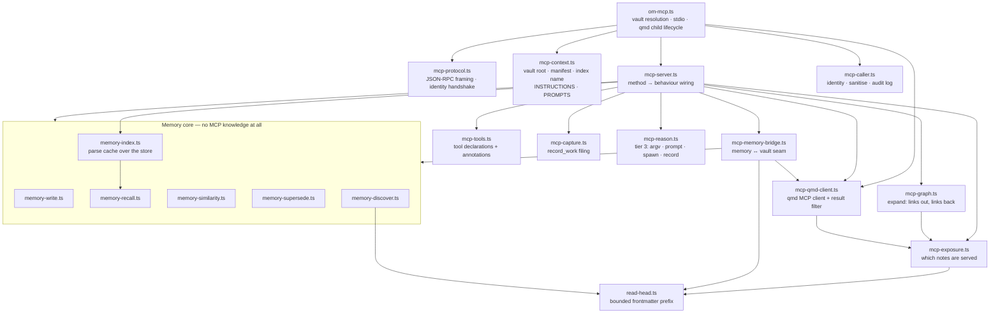

The memory core knows nothing about MCP. That is what lets the epistemic contract be hammered by tests without an MCP client, a vault on disk, or a search index.

### Connection: the identity handshake

Almost everything this server does depends on **who is asking**. MCP provides that: the server can ask the client which directories the calling session has open (`roots/list`). It is derived from the client, never declared by the caller, so there is no argument through which a session could claim to be a project it is not.

The complication is that the handshake is *asynchronous*, and the client's first `resources/list` arrives before it resolves.

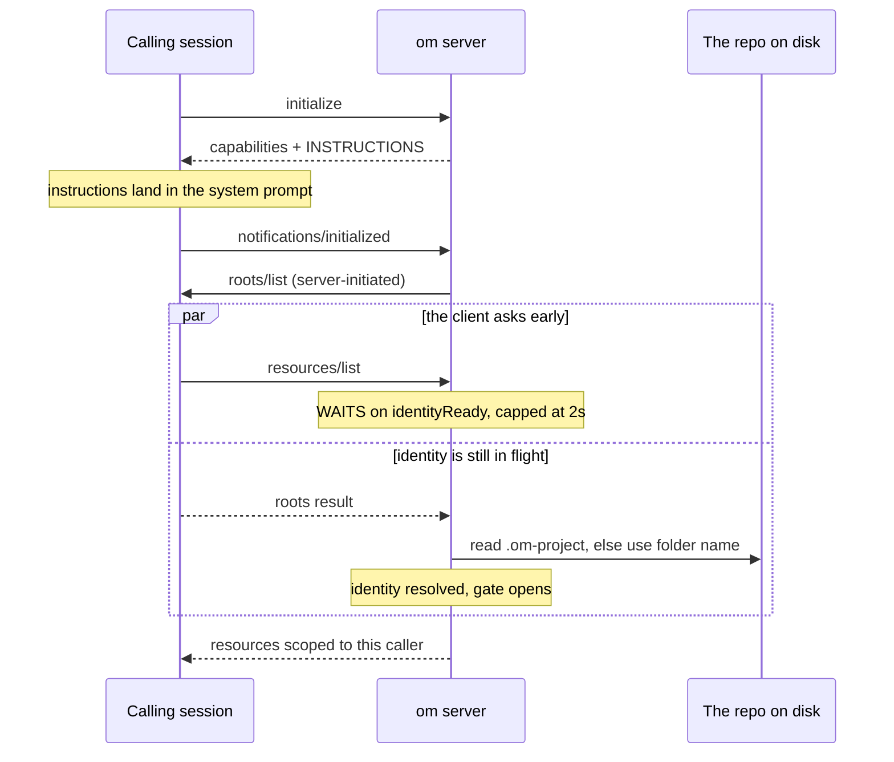

Announcing `notifications/resources/list_changed` after the fact was tried first, and the client did not re-fetch — the listing simply stayed unscoped. The deterministic fix is the wait: **something that scopes by caller must not answer before it knows the caller.** The cap matters too — a client that never answers gets an anonymous, general-only view rather than a hang.

The same gate reopens on `notifications/roots/list_changed`. Without that, a tool call arriving between the notification and the reply was served under the *stale* identity: the same race, one step later in the lifecycle.

**Identity resolution:**

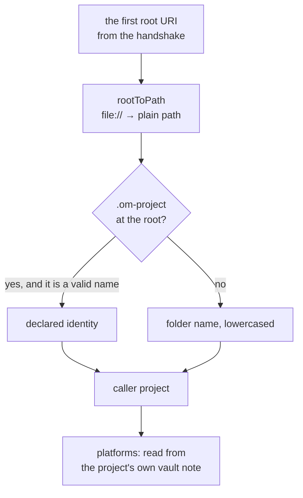

The folder name is right until it isn't: two repos both called `api` share one identity and therefore each other's memories. `.om-project` resolves that, and `health` reports which source was used so the collision is discoverable rather than mysterious.

### Which notes the server serves

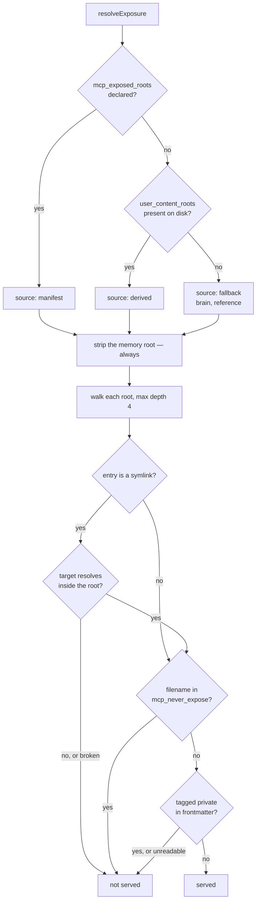

The default is the vault's own `user_content_roots`, at the granularity the manifest declares them — `work/active/`, not all of `work/`. Roots are **path prefixes**, matched on whole segments, so `work/active` does not admit `work/active-secrets`.

`mcp_exposed_roots` narrows that, and exists for the unusual vault holding material that is *not the user's to share* — employer-confidential notes, a client's data. Both exposure keys ship empty: the template must not impose one vault's sensitivities on every install.

> **What this list is, and is not.** It decides which notes the server *serves*. It is not an egress control: a session started with `--add-dir` reads the whole vault regardless, so narrowing the read surface prevents nothing on its own. Keeping vault material out of a public PR is the job of the **prohibition in `instructions`** — the form measured to hold — plus the **audit log**. Reading this list as a security boundary leads to a narrow default, and a narrow default fences off the user's own project notes, which are the single most useful thing a coding session could read.

Three things hold regardless of configuration:

- **`memories/` is never served as an ordinary note.** Memories carry their own declared reach, evaluated per caller; the note surface would bypass it. It is stripped from the root list unconditionally, and again during the walk.
- **A symlink is contained before it is followed.** The walk `lstat`s each entry — which describes the entry rather than its target — and resolves any link against the root's realpath. Enumerating with `stat` instead means a `.md` link inside an exposed root pulls in a file from anywhere on disk.
- **Every read is logged** to `.claude/om-mcp-audit.jsonl` (gitignored, rotated at 5 MB, one generation kept) with the calling repo — so "what did that session actually see" is answerable afterwards.

Every read surface resolves through `visibleFiles`. `search` filters its hits against it, `expand` computes backlinks only over it, and the resource enumerators build from it. This is one implementation rather than three because the recurring defect in this layer is a *second* read path that reaches notes by its own route and applies a different rule.

The symlink case is that defect in its most recent form, and worth keeping as the worked example: `resolveResourceUri` did realpath containment from the start, while the enumerator followed links silently. So the resource *listing* published an out-of-vault file's description and `expand` returned its body, while reading the very same URI was refused. Both ends now contain against the **matched declared root** — not the first path segment, since roots are prefixes and `work/active/` and `work/1-1/` share one.

### A `search` call, end to end

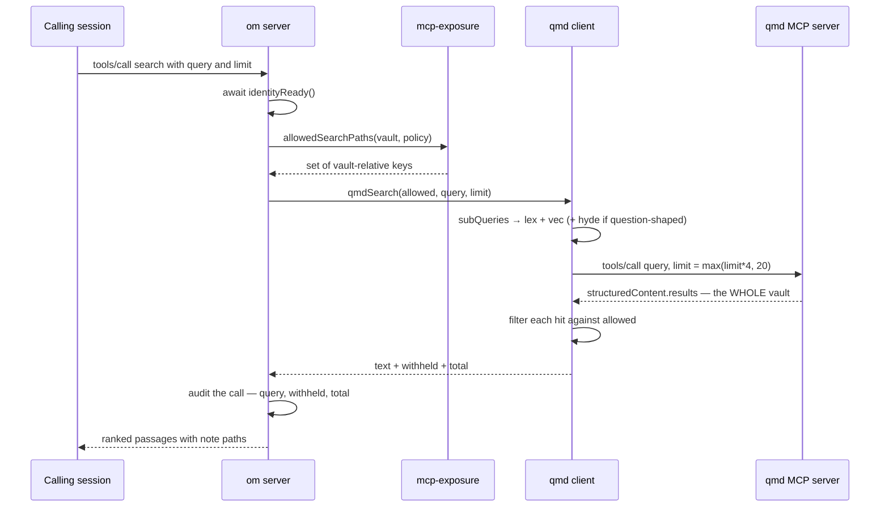

Four details in that flow are decisions rather than mechanics:

**The server is an MCP *client* of the vault's own qmd server.** Reusing the existing launcher inherits two fixes for free — the Windows `.cmd` shim workaround and the named-index pin — and the launcher is *located* rather than hardcoded, because a stale path here kills search silently.

**Filter the result, never the query.** The index covers the whole vault, including memories and any folder outside the served roots. Filtering the query would require every caller to construct a scoped query correctly; filtering the result means no query a caller can write returns more than the policy serves. Refusing to answer when `structuredContent` is absent belongs to the same rule — qmd's human-readable summary carries note paths too, so falling back to it would return results nothing ever checked.

**Over-fetch, then trim.** Because the filter runs on the result, asking qmd for exactly `limit` means a vault with much unserved content returns far fewer than requested with no sign that more existed. The client asks for `max(limit * 4, 20)`.

**HyDE is conditional.** `lex` and `vec` always go out together — keywords find the exact term, vectors find the note that answers the question without using the word. `hyde` writes a hypothetical answer and matches against *that*, which is what finds the note whose title shares no words with the question. It runs a local generation model, so it is added only for queries that are at least four words *and* question-shaped. A two-word keyword lookup, where lexical matching is already the right tool, does not pay for it.

**Degradation is explicit.** qmd is optional in this template. A failed call degrades that one search and says so; it must never present as "the vault is empty". The client tracks liveness, so one qmd crash does not disable search for the life of the server, and the entry script replaces a dead child behind a 5-second cooldown so a permanently-broken qmd cannot fork a process per call.

### Which memories reach which repo

This is the part the layer exists for. Every memory declares its reach **when written**, and a reader never widens what a writer declared.

```yaml
scope: project              # general | platform | project
projects: [atlas, atlas-api]  # a LIST — the multi-valued axis
platforms: [ios]
confidence: verified
origin: atlas               # derived from the roots handshake, not caller-asserted
session: 2026-07-26T14:02:11Z
```

The list is the load-bearing choice. **A memory is multi-valued; a folder is not.** A lesson touching two projects and a cross-cutting theme has no correct folder — you would pick one and lose the rest, or duplicate and have two sources of truth. A `memories/<project>/` taxonomy was designed and rejected for exactly this. Time is the only thing in the path, because it is the only single-valued fact about a memory:

```
memories/2026/07/2026-07-26 <title>.md
```

Visibility is evaluated in order, and the order **is** the design:

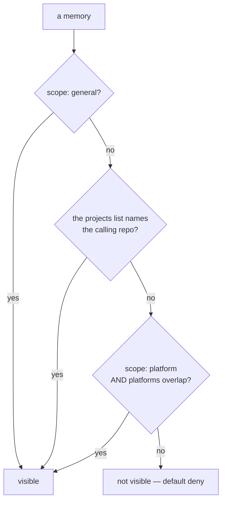

- `general` reaches everyone. The only scope that does, which is why the write path polices it hardest.
- **An explicit project listing always wins**, whatever the declared scope. This is what makes the multi-project case work: `projects: [a, b]` reaches both, and neither has to know the other exists.
- `platform` reaches any caller sharing a platform — an iOS lesson reaches the next iOS app and must *not* reach the web one.
- Otherwise, not visible. A near-miss does not surface.

A caller with no roots sees `general` only: the safest reading of "I don't know who you are", and it degrades to useless rather than to wide-open.

**Ranking, once visibility has decided the set:**

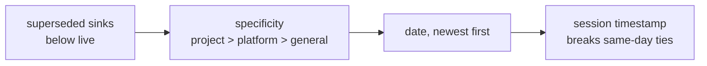

A memory naming *only* your project outranks one naming five. `date` is day-granular, so without the session tiebreak a just-written memory could sort arbitrarily and fall outside the caller's limit.

**Adding a query on top:**

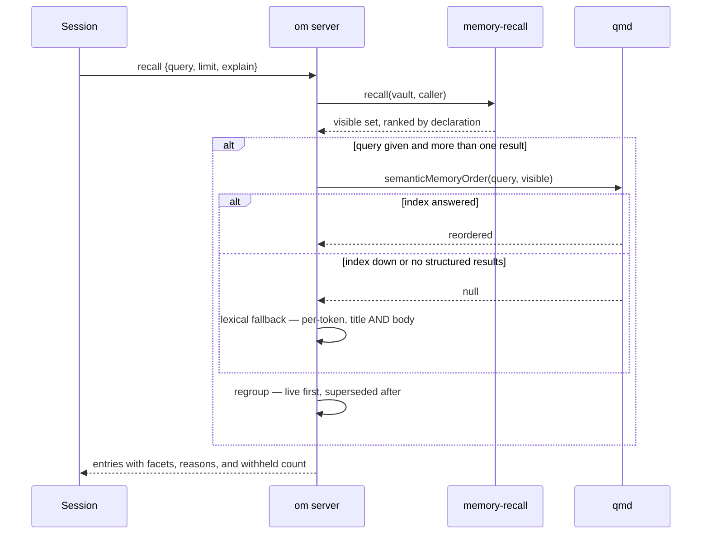

Three properties in that path each closed a real defect:

- **Retrieve semantically, then filter by visibility — never the reverse.** The index sees every memory including other projects'. Applying the scope rule to the *result* keeps one implementation of it, so semantic recall returns exactly the set plain recall would.
- **Semantic ordering REORDERS; it does not filter.** An earlier version returned only the memories the index matched, so a just-written memory — no embedding yet — vanished from recall at every limit. Anything the index did not place is appended in declared order.
- **Relevance orders within groups, never across the supersession boundary.** Reordering by relevance alone puts a corrected-away fact above the correction that replaced it, which is the one thing supersession exists to prevent.

A missing index degrades *ordering*, never availability. "The vault knows nothing" is not an acceptable answer to a wiring problem.

### Reading the store without re-reading it

`recall` and the duplicate scan read the same files and parse the same frontmatter, once per call each. That is linear in the store, and it runs on every recall and every write. `memory-index.ts` caches the **parse** — and only the parse.

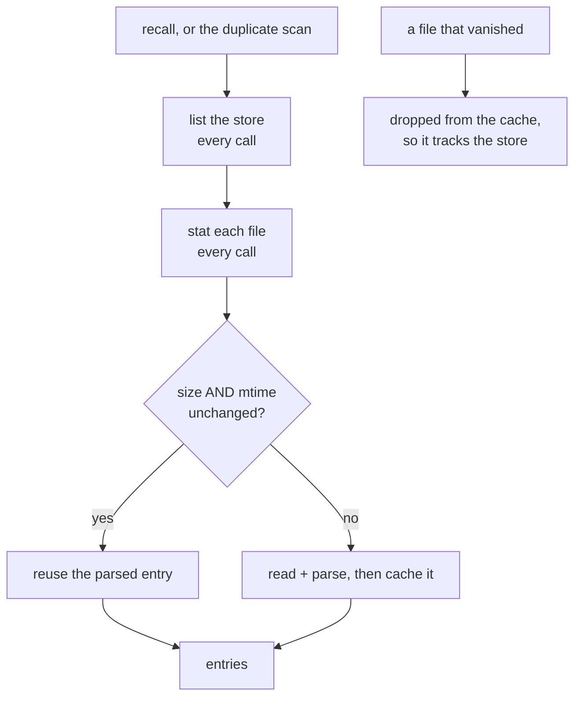

The listing and the stat happen on **every** call. Only re-reading and re-parsing an unchanged file is skipped, which is what makes this safe on the duplicate path: a memory written a second ago is always seen, and a stale view there would admit a duplicate permanently, because nothing downstream re-checks.

Size *and* mtime, because either alone is weak — some filesystems keep mtime to a whole second, and supersession rewrites frontmatter in place, which can preserve length. Writers also invalidate explicitly, so correctness never rests on timestamp resolution.

**It is deliberately in-process, not on disk.** Measured, these walks are a minority of a queried recall — the local query embedding dominates — so persisting the index buys a fraction of one operation while adding a file that can rot, disagree with the store, or need migrating in every vault that ever installed the template. The server is long-lived per repo, so every call after the first is warm and a cold start costs what it always did.

The same reasoning trimmed a second cost. Several call sites inspected only a note's frontmatter — is it private, what is its description, what are its aliases, was it agent-written, which platforms does the calling repo declare — and each read the **whole file** to look at its first kilobyte. `visibleFiles` does that for every note it enumerates, on every search, expand and write, so the cost scaled with the vault's total **bytes**: one long reference note made every unrelated call slower. `read-head.ts` reads a bounded prefix instead, preserving the exact string the old expression produced.

### The write path

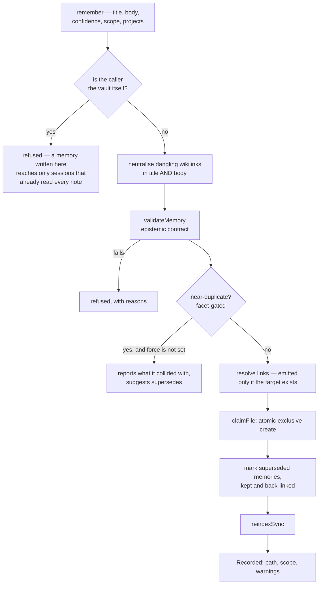

**The vault does not write to its own memory layer.** A session inside the vault already reads every note directly, and a memory written there would be scoped to the vault-as-a-project — reaching only sessions that by definition did not need it. Write-only by construction, so it is refused rather than allowed to accumulate.

**The claim is atomic.** `writeMemory` originally used check-then-write. Six processes reporting success produced *four files* — silent loss, reproducible only across real processes, and one-server-per-repo is the actual deployment shape. It is now an exclusive create (`COPYFILE_EXCL`), guarded by a test that spawns real processes, since a single-threaded test serialises the calls and always passes.

**Re-indexing splits by what each step guarantees:**

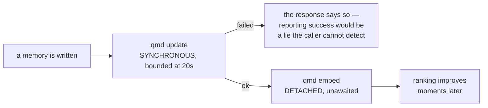

`update` decides whether the note is retrievable at all, so it is synchronous. `embed` only decides where it *ranks*, and recall appends everything the index did not match in declared order — so waiting on a local model run for ordering that corrects itself moments later buys nothing. Measured, it was most of the write.

The vault normally re-indexes from a PostToolUse hook, but an MCP write is not a Claude Code tool call, so **no hook fires**. Without this step a note sits on disk and cannot be found, which is worse than no note because it looks like the system worked.

**`record_work` is the sibling tool, and the two are constantly confused.** The distinction is single-valued vs multi-valued: a work record is about one project at one moment, so it has a correct folder and gets filed into it. Routing is *delegated* to the calling session — which already carries the vault's conventions and can search to see where similar notes live — and the server's job is to validate, never to guess. A caller-supplied folder must resolve inside a declared root, with containment checked against **that root** rather than merely the vault: `brain/../work` passes a first-segment check and still resolves inside the vault, which is how a capture once landed in a folder nobody named.

### Tier 3: reasoning, and why it has to spawn

Everything above answers without inference. `search` returns passages, `expand` returns neighbours, `recall` returns memories in a defensible order. None of them can answer *"is what I am about to do consistent with what these six notes decided, and what do I do about the two that disagree?"* — retrieval hands you the notes. Something has to read them.

The server cannot borrow the calling session's inference to do that. MCP has a name for it — **sampling**, where a server asks its client to run a completion — and Claude Code does not implement it ([anthropics/claude-code#1785](https://github.com/anthropics/claude-code/issues/1785)). So `reason` starts a session through the user's own CLI.

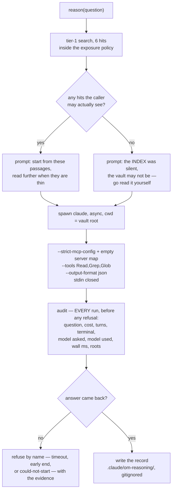

**It runs on the caller's own model, by running on none of its own.** MCP gives a server no way to see which model the calling session is using, so there is nothing to mirror. Passing no `--model` at all makes the spawn take the user's CLI default — whatever they get typing `claude` — which is the closest reachable thing to *the level they are already working at*. A vault that wants something else sets `reason.model`. Bare aliases — `haiku`, `sonnet`, `opus` — are dropped in favour of inheriting, because `--model haiku` is not honoured and does **not** error: it silently runs `claude-sonnet-5`, and a pin that quietly means a different model is worse than no pin. Anything else is passed through as written rather than matched against a shape, since an id-shaped allow-list drops real ids it did not anticipate. Every answer names the model that actually ran, and says whether that was the pinned one.

**Usage is answered by the record, not by a limit.** Every invocation is appended to the audit log — before any refusal, so a run that produced no answer is still recorded — with the question, cost, turns, terminal reason, model asked for, model that ran, wall time, and the roots the spawn was given. `health` reports the day's figure from the tail of that log, and says *at least* when the log was too large to read whole: a number standing in for a cap has to admit being a floor rather than quietly under-report on the busiest day. The spawn is Claude, on the user's machine, under the user's auth, on the account the calling session already runs on; a server-side bound there would be this layer rationing the user's own resource back to them. The one bound present is a 300-second timeout, which kills a **hung child** — a failure, not a preference.

**Isolation is what stops it recursing.** `--strict-mcp-config` pointed at a config declaring no servers leaves the spawn with no MCP at all, so it cannot call back into `om` and start a tree that multiplies at every level. Verified on the wire: a spawn under those flags reports no MCP servers available.

**Read-only comes from restricting the toolset, not from a permission mode.** `--tools Read,Grep,Glob` removes the writing tools outright, so an attempted write returns `No such tool available: Write` rather than waiting on a prompt nothing is there to answer. `--permission-mode plan` was the first attempt and is wrong twice over: it writes the plan under `~/.claude/plans/`, outside the vault, and it changes what the spawn believes it is producing — in a measured run the model composed its analysis *as a plan*, could not hand it back without `ExitPlanMode` headlessly, wrote the content to a file and returned a one-line note about having done so. The whole answer was lost, and the failure is non-deterministic, so it survived the first round of testing.

A related trap, since it is how that one nearly got mis-diagnosed: **a spawn's account of its own tools is unreliable.** Asked to list them under this allowlist, it returns the full default set including `Write`. Asked to actually write a file, it cannot. It reports its prior, not its runtime — so capability is checked by trying, never by asking.

**The spawn is told the same boundary its seed was filtered through.** `Read,Grep,Glob` with `cwd` at the vault root reaches the whole tree, while the seed came through `allowedSearchPaths` — so without an explicit boundary the one tool that reads most would be the only one ignoring `mcp_exposed_roots`, and could quote `memories/` scoped to other callers into its answer. The prompt therefore names the exposed roots and prohibits everything else, in the prohibition form measured to propagate. It is a boundary the spawn observes, not one the filesystem enforces, which is exactly why the audit line records the roots it was given: what it was allowed to read stays answerable afterwards.

**It runs asynchronously, and that is load-bearing.** A synchronous spawn holds the whole event loop for the life of the child — measured at 73–80s, capped at 300s — during which the server parses no stdin at all: no other tool call, no `ping`, no `roots/list` reply, and no timers, so even the identity gate's own 2s cap could not fire. The entry script buys concurrency deliberately (*"serialising them here would make one slow search block every other call"*), and a synchronous spawn took that back harder than serialising would have. Verified on the wire: with `reason` running for 80.3s, a `search` and a `health` issued two seconds in came back at 2.9s and 2.8s.

Two things about the spawn are non-obvious and were found the hard way. **stdin must be closed**, or the CLI waits on it and the call hangs to the timeout instead of answering. And the binary is spawned **directly with argv, never through a shell** — on Windows `cmd.exe` strips the quotes out of an inline JSON argument, and the CLI then tries to open the mangled string as a file path.

**The seed prompt has two branches, and the second one exists because of a measured failure.**

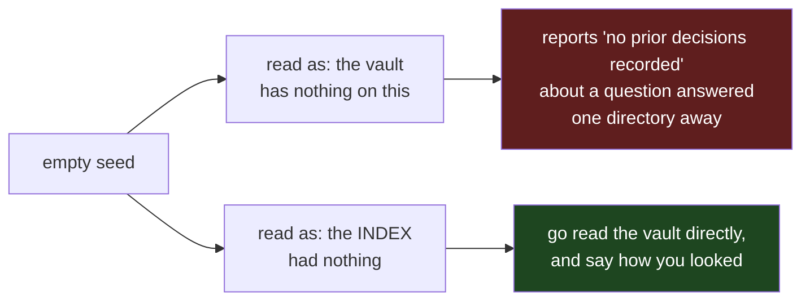

A vault whose index is missing or stale returns exactly what a vault with nothing to say returns. Under the normal wording the spawn treated the first as the second and reported silence — the same *absence-read-as-answer* failure this layer already had in retrieval, reproduced one tier up. The empty case therefore gets its own instructions rather than a blank evidence block.

Which branch fires is decided by the **permitted** hit count, not by qmd's total: `total` counts what the index returned *before* the exposure policy filtered it, so a search whose every hit was withheld has `total > 0` and nothing the spawn can see. Reading the total alone would hand it an empty evidence block — precisely the shape that produced the false-absence answer. The prose sentinels (`(no results)`, `search failed: …`) remain as a fallback for callers holding only the text, matched as prefixes so a passage that merely quotes one of those phrases still counts as evidence.

Against a vault whose index is working, seeding is worth about **one turn** — less than it looks like it should be, because a spawn with `cwd` set to the vault already inherits the vault's contract and can search for itself. Its value there is mostly that it starts in the right place, and it carries a bias: in a measured run the seeded answer leaned on the passages and repeated a framing the vault had since corrected. Hence the explicit licence in the prompt to read past the evidence, and the instruction to say when it is thin.

Losing the index entirely costs less than it sounds like it should. Same vault, same question, same build, run solo and sequentially so nothing competes for the machine:

| condition | turns | wall | reported cost |
|---|--:|--:|--:|
| index working, seeded | 23 | 72.8s | $0.37 |
| no index at all, 1,267 notes | 26 | 76.2s | $0.44 |

Three turns and four seconds. The fallback branch does exactly what it is told — enumerates the note tree, greps it, reads every distinct note, correctly identifies the 1,200 synthetic filler notes as filler, reports *how it looked*, and only then says nothing is recorded — and a spawn sitting in the vault turns out to be good at that. **The index makes tier 3 cheaper, not viable.** The thing that would make it useless is the failure above: concluding silence without looking.

> Both figures are from the shipped flags. An earlier measurement here showed 143s for the unindexed case and was wrong about the cause — it was taken under `--permission-mode plan`, where the turns went into composing a plan rather than into reading the vault.

**An early end returns no answer, not a short one.** If the spawn errors, times out, or stops before producing a result, the tool refuses and hands back the evidence the search already found. A truncated synthesis presented as a complete one is the single outcome worse than admitting there isn't one.

**Answers are not memories.** The record lands in `.claude/om-reasoning/` — gitignored, outside the note tree, skipped by every read surface because it is a dot-directory — carrying `confidence: inferred`. Auto-recording it would fill the store with machine conclusions nobody asked for and nobody verified, and the epistemic contract exists precisely to stop that. The calling session decides whether any of it earns a `remember`.

### Failure modes, and how each is made visible

Every failure in this layer presents identically as **"no results"**. That is what `health` exists for.

| failure | how it presents | what surfaces it |
|---|---|---|
| memory root renamed in Obsidian | recall returns nothing | `health` reports the discovered root and the drift |
| captures split across two roots | recall sees only one | `health` warns, naming both |
| qmd index belongs to another vault | search returns nothing | `health` checks index ownership |
| qmd not installed | search degrades to lexical | `health` reports the launcher missing |
| `OM_VAULT_PATH` points elsewhere | *everything* describes the wrong vault | `health` warns when it disagrees with the launcher location |
| caller unidentified | only general memories visible | `recall` says so in prose; `health` says ANONYMOUS |
| memory scoped away | absent from recall | `recall` with `explain: true` gives counts and reasons |
| two repos sharing a folder name | each sees the other's memories | `health` reports the identity source and suggests `.om-project` |
| the CLI is not on the server's PATH | `reason` cannot start at all | the refusal names the spawn error; `OM_CLAUDE_BIN` points at the binary |
| a pinned `reason.model` is ignored | answers come from another model, silently | the answer names the model that actually ran, and flags the mismatch |
| a reasoning spawn ends early | would otherwise read as a complete answer | refused by name, with the turn count, the terminal reason and the evidence |
| a reasoning spawn hits the 300s timeout | looks identical to a spawn that never started | the kill signal is read, so the terminal reason is `timeout`, in the message and the log |
| the server exits mid-spawn | a session runs on with no bound and no audit line | shutdown kills every in-flight spawn |

A stray `VAULT_PATH` was honoured at one point, and that name is too generic to claim — it is set for unrelated reasons on real machines, and the result was a server serving a *different* vault while reporting that vault's config as if correct. Only `OM_VAULT_PATH` is read now.

### The install is two steps, and both are required

```json
{
  "mcpServers": {
    "om": {
      "command": "node",
      "args": ["<absolute path to your vault>/.claude/scripts/om-mcp.mjs"]
    }
  }
}
```

That goes in the **consuming project's** `.mcp.json`. Then add a short section to that project's own `CLAUDE.md` telling it the vault exists and to consult it.

Step 2 is not documentation garnish. Measured: with the server wired and no repo-side instruction, a session made **zero** vault calls and implemented a design the vault had recorded as explicitly rejected. With the instruction present, it refused and cited the note. This follows directly from the prohibition/routing asymmetry above — and it makes the repo-side snippet a shipped deliverable, since a server installed without it is a server that gets ignored.

> **Do not register the raw `qmd` server in a consuming repo.** It searches every note directly, with no notion of which memories were written for which project, so the repo matches against lessons meant for unrelated ones. Applying declared scope on top of the index is exactly what `om` adds, and going around it returns the **wrong** things, not merely more of them.

---

## Multi-Agent Portability

The same scripts serve three agents. Each agent has its own config file mapping its own event names to the shared scripts. The event vocabularies differ — Claude Code calls it `Stop`, Gemini calls it `SessionEnd`, Codex has no compaction event — but the scripts are identical.

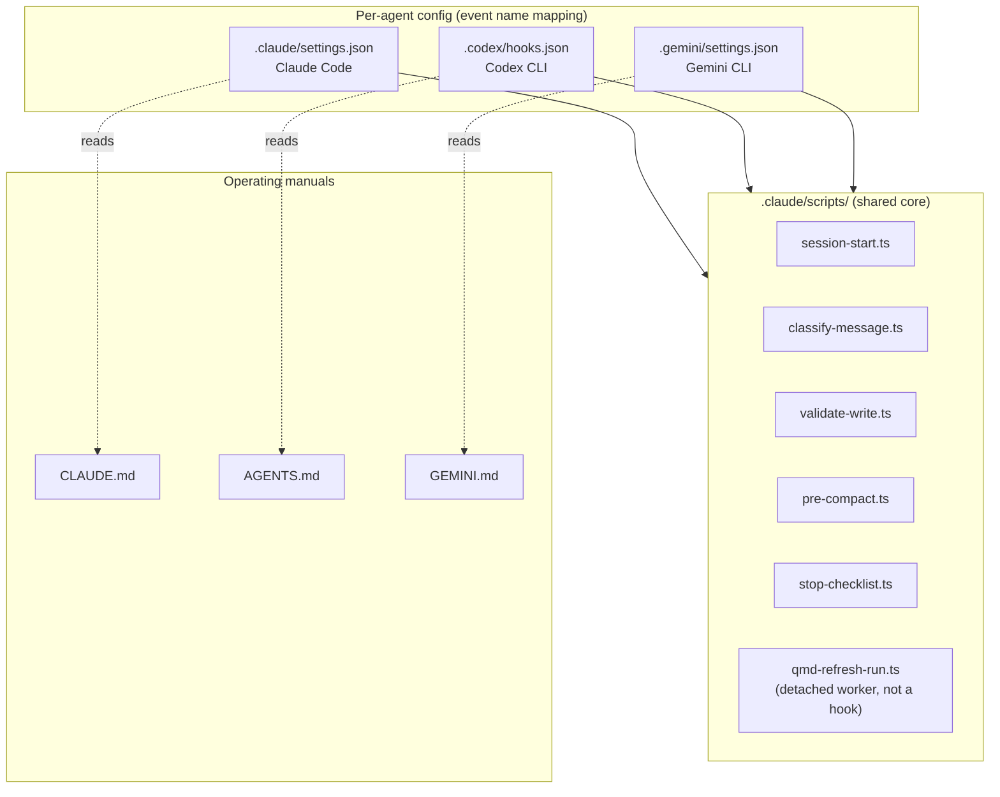

Commands in `.claude/commands/` are plain Markdown prompts. Claude Code invokes them as slash commands. Codex and Gemini treat them as regular prompts (users type `om-standup` without the leading slash). No SDK binding is required.

Adding a fourth agent means writing one more config file and, ideally, one more operating manual if the agent reads context files natively.

The `om` server sits outside this table on purpose. It speaks MCP over stdio and knows nothing about which harness is on the other end, so it needs no per-agent config at all — any MCP-capable client registers it the same way.

---

## Vault-First Memory

There are two memory systems, and the distinction is load-bearing:

```mermaid
flowchart LR
    SessionStart["SessionStart hook<br/>(.claude/scripts/session-start.ts)"]
    subgraph Ephemeral["~/.claude/ (not git-tracked)"]
        MemIndex["MEMORY.md<br/>(auto-loaded index)"]
    end
    subgraph Durable["Vault (git-tracked)"]
        NorthStar["brain/North Star.md"]
        BrainIdx["brain/Memories.md<br/>(topic index)"]
        Gotchas["brain/Gotchas.md"]
        Patterns["brain/Patterns.md"]
        Decisions["brain/Key Decisions.md"]
    end

    SessionStart ==>|reads every session| NorthStar
    MemIndex -->|points at| BrainIdx
    MemIndex -->|points at| Gotchas
    MemIndex -->|points at| Patterns
    MemIndex -->|points at| Decisions
    BrainIdx --> Gotchas
    BrainIdx --> Patterns
    BrainIdx --> Decisions
```

Two load paths into a session, both landing in the vault:

- **Pointer indirection** — `~/.claude/.../MEMORY.md` is Claude Code's private auto-memory directory. The template uses it only to hold a thin index that points at vault locations. Topics fire on demand when the conversation touches them.
- **Direct injection** — `brain/North Star.md` is loaded by the `SessionStart` hook on every session as its own context block. It's the goals document; it needs to be present every time, not only when triggered.

All actual memory content lives in `brain/` as real Obsidian notes — queryable by QMD, visible in the graph, and shared across every agent (Claude Code, Codex, Gemini) because they all read the same vault.

The rule that enforces this: "when asked to remember, write to the relevant `brain/` topic note, not to `~/.claude/`." It is restated in `CLAUDE.md` because it is the easiest rule to break and the hardest to detect breaking.

### Two stores, one vault

`brain/` and `memories/` look similar and answer different questions. Keeping them apart is deliberate.

| | `brain/` | `memories/` |
|---|---|---|
| written by | a session **inside** the vault, or you | a session in **another repo**, through `om` |
| shape | curated topic notes, edited over time | append-only atomic entries under `YYYY/MM/` |
| reach | the whole vault, always | declared per entry — `scope`, `projects[]`, `platforms[]` |
| corrections | edit the note | a new entry that `supersedes` the old, which is kept and back-linked |
| browsing | the note itself, and the graph | `bases/Memories.base` — Recent, By project, Needs review, Superseded, General reach |
| served as an MCP resource | yes, if inside an exposed root | **never** — reach is per caller, so the note surface would bypass it |

Both are Markdown in the vault, both are in the graph, both are git-tracked. The difference is that a `brain/` note is a *document you maintain*, while a memory is an *immutable claim with a declared audience and a confidence level*.

The third store is `~/.claude/.../MEMORY.md`, which holds no content at all — only pointers. The template creates nothing else there, and `validate-write.ts` blocks attempts to.

---

## Skills and Commands

The template ships two categories of skills:

- **Obsidian-native skills** (`kepano/obsidian-skills`) in `.claude/skills/` — teach the agent Obsidian-flavored Markdown, the Obsidian CLI, Bases, and JSON Canvas. Loaded automatically when relevant.
- **A custom QMD skill** in `.claude/skills/qmd/` — teaches the agent the preference order for vault retrieval (MCP tools when registered → `qmd` CLI as fallback → Grep/Glob as last resort) and the signals that should trigger a proactive search (past decisions, incidents, people, architecture, duplicates before creating a note).

Slash commands in `.claude/commands/` are operational workflows (e.g. `/om-standup`, `/om-wrap-up`, `/om-review-brief`). Each is a Markdown file with prompt instructions. Subagents in `.claude/agents/` are invoked by those commands to keep heavy operations (Slack archaeology, PR deep scans, vault migration) out of the main context window.

The rule for adding a new command: if it produces durable knowledge, it should write to the vault. If it would only make sense within one session, it is probably better as a prompt pattern than a command.

---

## Extension Seams

The design makes these changes easy:

| Change | Touch this |
|--------|------------|
| Add a new note type | `vault-manifest.json` → `frontmatter_required`, and a template in `templates/` |
| Isolate this vault from others on the same machine | automatic (folder-derived); override with `vault-manifest.json` → `qmd_index`, then re-bootstrap |
| Add a new classification category | `.claude/scripts/classify-message.ts` + `CLAUDE.md` routing rules |
| Add a new lifecycle behavior | A new script in `.claude/scripts/` wired into all three agent configs |
| Add a new agent (Cursor, Windsurf, …) | New config file mapping events to existing scripts, optionally a new operating manual |
| Add a new subagent | A new Markdown file in `.claude/agents/`, referenced from the command that invokes it |
| Add a new Base view | A new `.base` file in `bases/`, embedded from `Home.md` if it should surface |
| Change which notes `om` serves | `vault-manifest.json` → `mcp_exposed_roots` / `mcp_never_expose`, or tag a note `private` |
| Move the memory store | Rename the folder in Obsidian — discovery finds it and `health` reports the drift; pin it with `memory_root` to be explicit |
| Add a new `om` tool | A declaration in `.claude/scripts/lib/mcp-tools.ts` + a case in `mcp-server.ts` — the description is what the model reads when deciding to call it |
| Change what the eager layer may spend | `vault-manifest.json` → `eager_layer_budget_bytes`, `listing_collapse_threshold` |

The design is hostile to these changes (on purpose):

- Storing memories outside the vault. The whole point of `brain/` and `memories/` is portability and graph visibility.
- Bypassing the manifest. If a new component needs to know the index name, the memory root, or the infrastructure boundary, it should read the manifest rather than hardcode.
- Hardcoding agent event names inside scripts. Event name translation is a config-layer concern.
- **Scoping vault notes per calling repo.** An earlier revision did this — a repo saw only its own notes — and it killed the most valuable measured capability, because the answers worth having come from *connecting* projects. Memories declare their reach; notes do not.
- **Adding a second read path.** Any new surface that answers "which notes exist" must resolve through `visibleFiles` rather than walking the vault itself.

---

## Upgrade Path

Template versions are tracked in `vault-manifest.json` with fingerprints that let `/om-vault-upgrade` detect an older vault's version by presence or absence of specific files. The migrator uses the infrastructure/user-content split to decide what to overwrite versus preserve. `CHANGELOG.md` documents what changed in each version.

The long-term stability guarantee is narrow: the manifest keys (`qmd_index`, `infrastructure`, `user_content_roots`, `frontmatter_required`, `memory_root`), the hook script names under `.claude/scripts/`, the `om-mcp.mjs` launcher path that consuming repos put in their `.mcp.json`, and the folder layout for user content. Everything else — including command names, subagent internals, and classification logic — is allowed to evolve between versions.

`memories/` is listed in `user_content_roots`, so an upgrade preserves it rather than treating it as template infrastructure. The launcher path is on this list because it is the one string that lives *outside* the vault, written into other repositories' config — moving it silently breaks every consumer.

## Install Paths

Two ways to bring obsidian-mind into a new directory:

**`git clone` — the original.** Clone the repo, open the folder in Obsidian, talk to the agent. Zero machinery beyond git. Every file ships verbatim; no install-time substitution. The hook scripts under `.claude/scripts/` only run when the agent triggers them. This path is the long-standing default and the one new contributors use to read the codebase.

**`shardmind install` — v6.** [ShardMind](https://github.com/breferrari/shardmind) is a package manager for Obsidian vault templates that produces the same vault as `git clone` plus a `.shardmind/` sidecar. A wizard collects four values (`user_name`, `org_name`, `vault_purpose`, `qmd_enabled`), gates eleven modules (4 always-on content, 4 removable content, 3 agent — `claude` / `codex` / `gemini`), and runs the lifecycle hooks: `bootstrap` (`.shardmind/hooks/bootstrap.ts`) initializes git and optionally bootstraps QMD when enabled, and `personalize` (`.shardmind/hooks/personalize.ts`) writes the user's name into `brain/North Star.md`. The shard contract is locked by three invariants:

1. **Invariant 1 — clone-equivalence under defaults.** `shardmind install --defaults` produces a vault byte-equivalent to `git clone` modulo Tier 1 exclusions (`.git`, `.github`, ephemeral `.obsidian/workspace*.json`), the engine metadata under `.shardmind/`, and a vault-root `shard-values.yaml`.
2. **Invariant 2 — hooks no-op on defaults.** Managed-file edits (e.g., the North Star personalization) live in the `personalize` hook, which the engine refuses to call when every value is at its default — so the invariant is engine-enforced, not hook-checked. With every value at its default, the install remains byte-equivalent to clone.
3. **Invariant 3 — post-update is additive-only.** The post-update hook restricts managed-file writes to `ctx.newFiles` (paths added by the new version), preventing clobbers of the merge engine's three-way resolution of user edits.

The contract surface lives at `.shardmind/shard.yaml` (manifest), `.shardmind/shard-schema.yaml` (values + module declarations), `.shardmind/hooks/{bootstrap,personalize,post-update}.ts` (lifecycle), and `.shardmindignore` at repo root (excludes `CONTRIBUTING.md`, README translations, marketing media from the install). Spec: [ShardMind `docs/SHARD-LAYOUT.md`](https://github.com/breferrari/shardmind/blob/main/docs/SHARD-LAYOUT.md).

**Additive principle.** `shardmind install` produces a strictly larger vault than `git clone` — never smaller, never different on shared paths under defaults. Deleting `.shardmind/` and `shard-values.yaml` from an installed vault leaves a working clone-equivalent vault. The same is true on the source side: deleting `.shardmind/` from this repo would produce a v5.1-shape working vault. ShardMind extends the clone experience; it doesn't replace it.

`shardmind update` (v6+) three-way-merges your edits with upstream changes — the moat that `git pull` doesn't provide for templates with installed-time personalization. `/om-vault-upgrade` remains the path for migrating a v5.x clone or arbitrary vault into v6 in place; once installed, `shardmind update` (or `shardmind adopt` for retroactive adoption) takes over.
