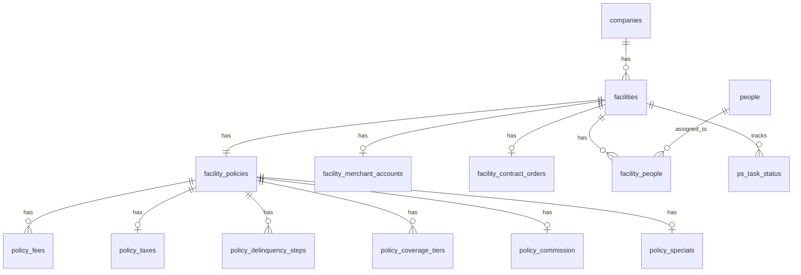

# Client & Facility Schema (Process Street-Sourced)

Schema for [[Process Street Integration — Kickoff & Findings]] — Step 2 of the build order in [[Onboarding Orchestrator Kickoff — Session Log]] (Client/Facility/Contacts schema), designed around real PS data rather than pure manual entry. **Phase 0 (this schema + RLS + a read-only PS API client) shipped 2026-08-28** — see the status note below. Everything past Phase 0 (ingestion, search, the client-record UI) is still design, not code.

**Settled 2026-08-28, after going back and forth once for real reasons.** First instinct (before the repo was opened): a new `clients` schema. Then corrected to reuse the existing `client_ops` schema on finding it already existed for "tooling an Onboarding Manager uses day to day." Then Boris pushed back and asked for a real opinion, not deference — and on reflection, a **new `clients` schema was the right call after all**, for reasons that don't just restate the first instinct: `client_ops` as it actually exists today (`qms_tag`, `vendor_format`, `tag_pattern`, its own `audit_log`) is tool-support/reference data — small, genuinely global, slow-growing. The clients themselves (companies, facilities, people, their policy configuration) are a much larger, faster-growing domain (14 tables already) that will need its own access-control boundary once "Groups" (client-scoped visibility) ever gets built — mixing it into `client_ops` would mean carving it back out later. By the same "distinct business domain" bar that justified splitting `client_ops` out of `auth` in the first place, this is a second, equally justified split. RLS/permissions are unaffected either way — `auth.current_user_has_role(...)` checks don't care which schema hosts the table.

**Status: Phase 0 shipped 2026-08-28** (uncommitted, awaiting Boris's review before commit) — migration `20260828120000_create_process_street_client_tables` creates the `clients` schema, applied cleanly to the Neon dev branch (after reverting the brief `client_ops`-based version first), `scripts/setup_app_service_role.sql` updated with a matching grant block, and RLS verified live both times (an `onboarding_manager`-role insert succeeds, a `sales`-role insert is rejected with `new row violates row-level security policy`, confirmed by direct query, not just by policy count). A matching read-only `ProcessStreetClient` Rust module (`src/process_street/`) was also built, mirroring `src/dropbox/`'s existing client/config/mod shape, with 4 passing unit tests against real captured PS JSON (pagination-following, the empty-page-but-has-next-link edge case, `null` vs. populated form-field values). Full crate test suite (348 tests) still green. See [[Implementation Plan]] for what's next (Phase 1: the actual ingestion/mapping layer).

## Naming: what was "billing_profiles" is now `facility_policies`

**Confirmed 2026-08-28: "Facility Policies" as the tab name.** Sub-tabs, per Boris's correction: **Fees | Taxes | Delinquency | Coverage** (Commission folded into Coverage, not its own tab — it's earned off insurance/protection-plan sales, so it belongs with it) **| Specials** (proposed 5th sub-tab — Specials is neither a fee, tax, delinquency step, nor coverage; it's promotional move-in pricing, its own category. Flagging for confirmation rather than assuming.).

## The decisions from last pass, resolved

**Owner vs. Signer roles — resolved, no schema change needed.** Both stay as distinct role tags on `facility_people`, not merged at ingestion. A person can simply have two rows (same `person_id`, same `facility_id`, `role = owner` and `role = signer`) when they really are both; a bookkeeper who is signer-only, with no stake in the business, just gets the one `signer` row. Application logic can treat `owner` as implying signer authority without that needing to be a schema constraint.

**People don't need a company-level table — this was a design note, not something requiring a decision.** No further action.

## Sister-site sharing — re-examined per Boris's concern, not yet fully resolved

Boris's concern: a shared `billing_profiles`-style row only works if fees/DLQ/taxes/etc. really are identical across every sister facility — and worse, this data might be captured on just the first-filled facility as **free text specifying which fee/policy applies to which specific facility**, not as clean structured data at all.

**Checked directly against Prairie Enterprises' real data**: this could not be confirmed or denied there. Carpentersville and Pyott Road's Fees/Delinquency/Coverage fields are genuinely blank (that onboarding step hasn't been reached for either), not populated with differentiating prose — so Prairie doesn't currently contain an example of a facility written in free text as applying only to specific sister sites.

**What WAS found, and matters regardless**: Highway 20's own completed run shows several of these fields are already informal free text in practice, not clean structured answers:
- `Delinquency Notes:` → `"SEE FEE INFO FIELDS"` — a human using a notes field as an internal pointer to another field on the same form, not a fixed value.
- `Any Other Fees:` → a multi-line list of ad hoc named fees with amounts and inline annotations (e.g. `"Moving Truck - Weekday Use $25.00 (THIS IS A RETAIL ITEM)"`).
- `Specials:` → a large nested-bullet block of promotional move-in discounts, clearly meant to be read as prose, not parsed as one value.

So: no confirmed case yet of a facility's free text naming a *different sister facility* by name — but confirmed proof that staff use these particular fields as prose/pointers rather than strict structured answers, which is the same underlying risk Boris is flagging. This is why the shared-row idea below was dropped entirely in the next revision rather than patched — see [[Gotchas#Process Street's "sister site" sharing has no definitive link between facilities — do not assume the "first-time" facility is always resolvable|Gotchas]] for the full history, now updated to reflect that OO's own design sidesteps this rather than needing to resolve it.

**Regardless of the sharing model, the free-text fields below must be surfaced verbatim in the OO UI next to any structured data, not silently discarded** — a human reviewing a facility's policies needs to actually read "Delinquency Notes" and "Specials," not just see parsed numbers.

## Sharing model replaced: explicit per-category copy action, not a shared row

**2026-08-28, resolves the open question above and supersedes the shared-`facility_policies_id` design entirely.** Boris confirmed DLQ policies vary across facilities just as often as Taxes do — Prairie's case (where Highway 20's data would apply uniformly) is not a rule, it's one observed instance. So no single "shared row per company" model is safe for *any* category, not just Taxes.

**New model: every facility owns its own rows in every category, always.** There is no FK from many facilities into one shared row anymore. "Sharing across sister facilities" becomes a real UI action instead of an implicit database relationship:

- The **Facility Policies** page has the five sub-tabs (Fees/Taxes/Delinquency/Coverage/Specials) across the top, and a facility selector — buttons, one per facility — in a rail between the left nav and the page content. Selecting a facility shows that facility's own data for whichever tab is active.
- Each tab gets its own **"Same for each facility"** button (with a `?` info icon explaining what it does) — an explicit, per-category, one-time COPY, not a live link. Clicking it: (1) shows a dire warning that every other facility's existing data in that category will be overwritten, (2) presents a **source-of-truth facility picker** — only facilities that actually have non-blank PS data for that category are selectable; facilities with none are excluded from the picker with a message explaining why, (3) on confirm, copies the source facility's rows for that category onto every other facility in the company, overwriting what was there.
- **The button itself doesn't appear at all if no facility in the company has any data for that category** — nothing to copy from, nothing to show.
- This button exists **independently per tab** — Fees and Coverage might get copied across all facilities while Taxes and Delinquency are left facility-specific, or any other combination. Nothing forces all five categories to be shared or unshared together.

**Schema implication**: `facility_policies` is no longer a row pointed to by many facilities — it's now **owned 1:1 by exactly one facility**. Implemented simpler than originally drafted here: `facility_policies.facility_id` IS the primary key directly (no separate synthetic `id`, and no reverse-pointer column on `facilities` — a 1:1 relationship only needs one foreign key, not two kept in sync), same shape as `facility_merchant_accounts`/`facility_contract_orders`. Every child table (`policy_fees`, `policy_taxes`, `policy_delinquency_steps`, `policy_coverage_tiers`, `policy_commission`, `policy_specials`) hangs off `facility_policies_id` referencing that same `facility_id`. The Prairie Enterprises sister-site question from PS's own side is no longer something OO needs to resolve automatically at all — each facility's data stands alone until an onboarding manager explicitly chooses to copy it.

### Audit trail for "Same for each facility" — reuses `client_ops.audit_log`, no new table
**Corrected on implementation**: rather than a new `policy_copy_events` table, this reuses the existing `client_ops.audit_log` (append-only, `entity_type`/`entity_id`/`before_state`/`after_state`/`metadata` JSONB already fit exactly this need) with a new event type, e.g. `ps_facility_policy_copied`, one row per target facility actually overwritten, `metadata` carrying `{category, source_facility_id}`. The Rust-side event constant and its INSERT-time usage are Phase 4 work (the actual UI action), not Phase 0 — Phase 0 only needed the RLS/table shape decided, which is why this section is documented in the schema-only migration's own header comment.

## Phase 1 model: raw text + a known-type tag, not decimals — nothing computed against yet

**Confirmed 2026-08-28, and this simplifies the whole area significantly**: every value in Facility Policies is pulled and displayed as **plain text, with a copy button next to it in the OO UI** — not parsed into a decimal `amount`, a numeric `days_after_paid_thru`, or a boolean `is_recurring`. This applies even to Coverage, which is PS's most structured step (dedicated percentage/level/premium fields) — still raw text for now, by explicit choice, not a data-quality limitation. The only thing OO adds on top of PS's own raw value is a **known-type tag**, so values land in the right labeled slot in the UI instead of an undifferentiated blob. Real PS field labels already do most of this classification for free — most of the "known" fee/tax/DLQ fields are already separately labeled fields in PS, not buried inside "Any Other Fees." Anything that only exists inside a free-text catch-all field (PS's own "Any Other Fees:", "Specials:", etc.) is tagged `other` and stored verbatim, not split apart further.

Real PS data shows variable cardinality in Fees and Delinquency (a facility might have 2 named "other fees" or 9; delinquency might have 2 late-fee steps or 5, "possibly more" per Boris) — so both are ordered child lists, not fixed columns.

### `clients.facility_policies`
Owned 1:1 by exactly one facility — `facility_id` IS the primary key directly (see "Schema implication" above for why there's no separate synthetic `id`).

| column | notes |
|---|---|
| `facility_id` | uuid pk, fk → `facilities` |
| `raw_ps_snapshot` | jsonb, nullable — full field dump from whichever run this was captured on |
| `created_at`, `updated_at` | |

### `clients.policy_fees` — **Fees** sub-tab
One row per fee. `fee_type` is the known-type tag; `raw_value` is PS's value verbatim, copy-button-ready, unparsed.

| column | notes |
|---|---|
| `id`, `facility_policies_id` | |
| `fee_type` | enum `security_deposit` \| `nsf_chargeback` \| `move_in_admin` \| `transfer` \| `cleaning` \| `other` |
| `label` | verbatim PS field label — load-bearing when `fee_type = other`, since "Any Other Fees" has no sub-label of its own |
| `raw_value` | text, verbatim — e.g. `"Optional Electrical $30.00 (R)"`, not decomposed |
| `is_recurring` | boolean, **nullable, unpopulated for now** — see the parsing note below |

### `clients.policy_delinquency_steps` — **Delinquency** sub-tab
An ordered sequence — notices, fees, pre-lien, lien, cut lock, auction, "possibly more." Flagged by Boris as needing real design work later (editable free-form + dropdowns); this is the Phase 1 capture shape it'll build on top of.

| column | notes |
|---|---|
| `id`, `facility_policies_id` | |
| `step_order` | int |
| `step_type` | enum `late_fee` \| `pre_lien` \| `lien` \| `cut_lock` \| `auction` \| `notice` \| `other` |
| `raw_value` | text, verbatim — whatever PS held, e.g. `"Name this Lockout Fee $10.00 (One-Time)"` |
| `is_recurring` | boolean, **nullable, unpopulated for now** |
| `notice_channel` | enum `document` \| `email` \| `sms` \| `combination` \| `unknown`, **nullable, unpopulated for now** — notice type is currently only ever in free-form comments |

> [!note] Recurring/notice-type parsing — deferred, but here's a head start
> Boris wants to eventually parse recurring-vs-one-time out of these comments and asked what patterns actually get used across PS's client forms. Three real, *different* phrasings already turned up in just the Highway 20 data pulled this session: `"(R)"`, `"(One-Time)"`, and `"(YES Recurring)"` — all on the same run, for the same concept. Worth handing to whoever does that comb-through as a concrete starting sample rather than starting from zero.

### `clients.policy_coverage_tiers` — part of **Coverage** sub-tab
Genuinely multi-row (PS supports up to 6 tiers) — kept as raw text per Boris's explicit call, not decimals, even though this is PS's most structured step.

| column | notes |
|---|---|
| `id`, `facility_policies_id` | |
| `tier_number` | int |
| `total_coverage_amount_raw`, `cost_to_tenant_raw` | text, verbatim |

### `clients.policy_commission` — part of **Coverage** sub-tab
Folded under Coverage per Boris's correction (commission is earned off protection-plan sales, not its own tab). Stays 1:1 — no variable cardinality observed.

| column | notes |
|---|---|
| `facility_policies_id` | unique fk |
| `commission_type_raw`, `dollar_amount_raw`, `percent_amount_raw` | text, verbatim |

### `clients.policy_specials` — **Specials** sub-tab (pending confirmation)
Deliberately one raw blob, not split into rows per special — PS itself stores the whole nested-bullet block as a single field value, and Boris's own framing ("this format is ideal for entry... matches the config steps in QMS") is about preserving it exactly as entered for copy-paste into QMS, not computing against it.

| column | notes |
|---|---|
| `facility_policies_id` | unique fk |
| `raw_text` | text, verbatim, whitespace/indentation preserved for the copy button |

### `clients.policy_taxes` — **Taxes** sub-tab
More structured than the rest (PS itself splits Sales vs. Rent vs. Additional One-Time vs. Additional Recurring as distinct fields), but every value below is still raw text, not parsed. No longer a special case now that no category is shared by default — see "Sharing model replaced" above.

| column | notes |
|---|---|
| `facility_policies_id` | unique fk |
| `sales_tax_applies_raw`, `sales_tax_rate_raw` | |
| `rent_tax_applies_raw`, `rent_tax_rate_raw` | |
| `rent_tax_applies_to_all_units_raw` | text, verbatim — Boris's flag: this can name specific unit sizes/types, not just yes/no, so it must stay free text, not a boolean |
| `other_one_time_taxes_raw` | PS's "Additional One-Time Taxes - Name/Rate/Attribute Payable" field, verbatim |
| `other_recurring_taxes_raw` | PS's "Name(s) & Rate(s) of Add'l Recurring Taxes" field, verbatim |

## Everything else, unchanged from last pass

### `clients.companies`
Corporate identity (legal name, DBA, corporate address/contact), `source` (`process_street`/`manual`), `ps_intake_run_id`, `raw_ps_snapshot`, `last_synced_at`. **Plus 5 Financial Information columns added 2026-09-03** (migration `20260903120000_add_company_financial_info_fields`): `accepted_payment_methods`, `accounting_basis`, `payment_scheme`, `offers_tenant_insurance_raw`, `insurance_provider` — all sourced from **Intake**, not Merchant Account as originally assumed (`values_for()`, a new helper for PS's MultiChoice field type, handles `accepted_payment_methods`). Full detail in [[Session 2026-09-02–03 — Confirmation Screen, Re-sync, Activity Logs & Client Record UI]]. Both `companies` and `facilities` also gained a `manually_edited_fields text[]` column (Phase 5, 2026-09-02) protecting manually-corrected fields from being silently overwritten by re-sync.

**The Merchant Account tables (`facility_merchant_accounts`/`facility_merchant_account_parties`) went live 2026-09-02/03** — `ingest_merchant_account_run`/`insert_party` existed since Phase 1 but had no real caller until the Add-to-OO Create flow was wired to actually invoke them (a real bug: the correlated Merchant Account run id was resolved at preview time and silently dropped before Create, so these tables stayed empty for every client created through the confirmation screen until fixed). See the same session note.

### `clients.facilities`
`company_id`, `facility_policies_id` (not null), name/address/phone/email, `units_count`, `primary_storage_offering`, `previous_pms`, `access_control_system`, `go_live_date`, `dropbox_folder_url` (customizable in OO), `source`, `ps_intake_run_id`, `raw_ps_snapshot`, `last_synced_at`.

### `clients.people` / `clients.facility_people`
Deduped person records; many-to-many at the facility grain with `role` (`owner` \| `district_manager` \| `manager` \| `signer` \| `order_placer` \| `poc`) — a person can hold more than one role via multiple rows, see the resolved decision above. `email` is the primary dedup key; name+phone matches need the same manual-review treatment [[Dedup Tool Index|the dedup tool]] already gives tenant contacts.

### `clients.facility_merchant_accounts`
1:1 with facility (confirmed always 1:1). `rate_provided`, `application_status`, `credentials_added_to_qms`, `source`, `ps_new_merchant_run_id`, `raw_ps_snapshot`, `last_synced_at`.

### `clients.facility_contract_orders`
Nullable existence per facility — **confirmed by Boris this is inconsistent for territory/sales-process reasons, not a data gap to chase**. When present, its important field is which legacy system the client is migrating off of onto QMS — that's the whole reason this workflow matters when it exists.

| column | notes |
|---|---|
| `facility_id` | fk → `facilities`, unique |
| `migrating_from_system` | text — the previous PMS/system named in the order, the operationally important field here |
| `source`, `ps_contract_order_run_id`, `raw_ps_snapshot`, `last_synced_at` | |

### `clients.ps_task_status`
Generic step-completion tracking (`facility_id`, `workflow`, `ps_task_id`, `task_name`, `status`, `last_synced_at`) — avoids hardcoding a column per PS step name.

### `clients.ps_sync_state` / `clients.ps_person_index` (added Phase 2, 2026-08-31)
Not in the original Phase 0 design above — added for person-name search, since PS has no server-side search over form-field values. `ps_sync_state` is one row per `(workflow, ps_run_id)` holding PS's own `audit.updatedDate` as of the last index; `ps_person_index` is a thin, disposable name/email/phone/role projection, rebuilt wholesale per run every time that timestamp moves. See [[Process Street Integration — Kickoff & Findings]] for the delta-sync mechanism.

**Decision, 2026-08-31: kept denormalized, not FK'd, at least for now.** Boris noticed the same real person (e.g. a facility's owner) gets multiple `ps_person_index` rows — one per facility's run, since PS itself copy-pastes the same Owner/DM/Manager text onto every sister facility (the sister-site behavior above). His instinct was that this looks like bad data structure and should go through FKs instead. Reasoning for leaving it as-is:
- `ps_person_index` has no `facility_id` to FK to in the first place — it deliberately indexes runs that may never get imported into `clients.facilities` at all. That's the whole point of letting someone search before import exists.
- Deduplicating people reliably requires the same manual-review discipline `clients.people` (the real, imported-client table) and the separate dedup tool already apply for exactly this reason — a naive name/email match risks silently merging two different people, or missing the same person under a slightly different email. Building that judgment into a table whose entire design is "disposable, rebuild-anytime, never hand-edited" is the wrong place for it.
- For the actual UI need (a checkbox per facility on the search page, see [[Process Street Integration — Kickoff & Findings]]'s "add client" flow), seeing the same name once per facility is the *correct* signal, not redundant noise — collapsing it into one row would lose exactly the per-facility granularity that screen needs.

Boris's call: leave it denormalized for now, revisit later. Not resolved, just deferred with the reasoning recorded — see "Open, past Phase 0" below.

## Caching strategy

Unchanged: named columns cover the fields Boris actually flagged as important; `raw_ps_snapshot jsonb` on every PS-sourced table keeps everything else without hand-modeling all ~120 fields per workflow up front.

## Open, past Phase 0

- **Whether `ps_person_index` should ever move to an FK'd/deduped shape** — deferred, Boris wants to think about it more (2026-08-31). See the decision above for the reasoning against doing it now.
- **Whether Specials gets its own 5th sub-tab** (proposed) or folds into an existing one — awaiting confirmation.
- Exact confirm-dialog copy for "Same for each facility" (the dire-overwrite-warning wording) and the excluded-facility explanatory message — not drafted, UI-copy work not schema work.
- The free-text-pointer risk above is not resolved, only better understood — see the updated [[Gotchas#Process Street's "sister site" sharing has no definitive link between facilities — do not assume the "first-time" facility is always resolvable|Gotchas entry]]. Still explicitly Phase II per Boris.
- Whether `companies`/`facilities` need a soft-delete or archival state for clients who leave PS or get merged/renamed.

## Phase 0, shipped 2026-08-28 — what actually exists now

- Migration `20260828120000_create_process_street_client_tables` (`unitprep-api`, both `.up.sql`/`.down.sql`) — applied and verified on the Neon dev branch: all 14 tables exist, each with exactly 4 RLS policies (select-authenticated, insert/update/delete-gated to `onboarding_manager`/`department_manager`). RLS itself verified live: an `onboarding_manager`-role insert into `clients.companies` succeeds, a `sales`-role insert is rejected with `new row violates row-level security policy` — not just "policies exist," the actual access boundary was exercised.
- `src/process_street/` (`unitprep-api`) — a read-only PS API client (`ProcessStreetClient`), mirroring the existing `src/dropbox/` module's shape exactly (config/client/mod split, the same error-enum-plus-status/body-logging pattern). Handles PS's pagination cursor (`links[].name == "next"`), including the real observed edge case where an empty page can still carry a `next` link. No write methods exist by design. 4 unit tests pass against real captured PS JSON shapes (Select/Date/unanswered form fields, Completed/NotCompleted tasks). `cargo build`/`test`/`clippy` all clean for the new code; full crate suite (348 tests) still green.
- **Committed 2026-08-28, not pushed**, as 3 commits on `main` (local, `origin/main` unaffected — `ahead 3`): `3037413` (clients schema migration + grants), `19a60fa` (the `ProcessStreetClient` module), `719e6bc` (version bump 1.8.10 → 1.8.11, its own commit matching this repo's established convention). Split cleanly with no conflicts against the other session's own work, which had already landed and been committed by the time this happened (its Dropbox-integration commits were visible in `git log` beforehand).
- `PROCESS_STREET_API_KEY` still needs adding to `.env.local` before Phase 1 can make a real live call — not added automatically since that file holds real local secrets.

## Phase 1 addition, 2026-08-28: field-level PII encryption on the Merchant Account tables

Pulling the New Merchant Account workflow's **full** field list while building Phase 1 ingestion (not just the handful of fields checked in Phase 0) surfaced real SSN, DOB, home address, EIN, bank routing/account numbers, and live QMS/processor system credentials for Prairie Enterprises' actual owners. This is the exact trigger the vault's 2026-08-07 PII/compliance review anticipated ("the first genuinely sensitive-government-ID use case... the trigger that would justify real field-level encryption"). Boris's direction: "field level encryption. audit passing grade. fort knox."

- New migration `20260828130000_add_merchant_account_encrypted_pii`: `facility_merchant_accounts.encrypted_secrets` (one encrypted blob for EIN/bank routing+account/QMS credentials) and a new `facility_merchant_account_parties` table (signer + up to 4 owners + up to 4 intermediary businesses, each a row; sensitive fields in a per-party `encrypted_pii` blob).
- Encryption mirrors `auth::totp`'s existing pattern exactly: ChaCha20-Poly1305, a version-prefixed blob, AEAD additional-authenticated-data binding each ciphertext to the specific row it belongs to (a facility for the secrets bundle; `facility_id:role:index` for a party's PII, so one owner's ciphertext can't be grafted onto a sibling owner within the same facility). New module: `src/clients/encryption.rs`, key env var `CLIENT_PII_ENCRYPTION_KEY` (separate from `TOTP_ENCRYPTION_KEY` — different credential class, different blast radius if one leaks).
- Both new-and-touched tables got their SELECT RLS **tightened** to `onboarding_manager`/`department_manager` only — not the blanket "any authenticated caller" every other `clients` table uses. Verified live with a real committed row: a `sales`-role query sees 0 rows, an `onboarding_manager`-role query sees the real row.
- `raw_ps_snapshot` on `facility_merchant_accounts` is now built from a **sanitized** field set with every sensitive PS key excluded (not just the encrypted ones re-included in plaintext elsewhere) — tested directly: the sanitized snapshot must contain neither the sensitive keys nor their values.
- This also prompted a full audit of the rest of the auth/RLS infrastructure for backdoors — came back clean. See [[Auth & RLS Security Audit — 2026-08-28]].

## Related

- [[Process Street Integration — Kickoff & Findings]]
- [[Onboarding Orchestrator Kickoff — Session Log]]
- [[Platform Vision (Onboarding Orchestrator)]]
- [[Auth & RLS Security Audit — 2026-08-28]]
- [[Session 2026-09-02–03 — Confirmation Screen, Re-sync, Activity Logs & Client Record UI]]
- [[Dedup Tool Index]]
